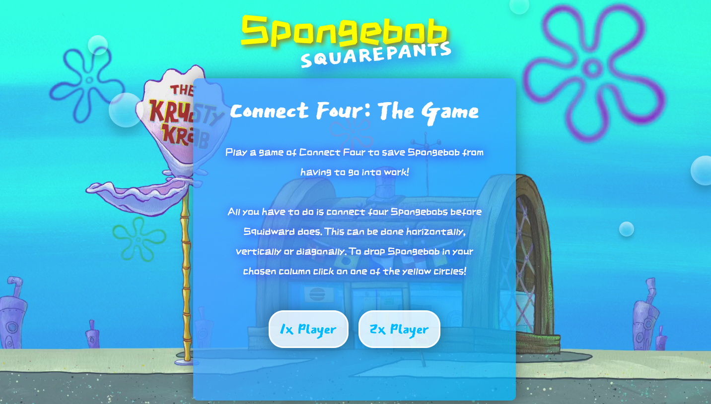
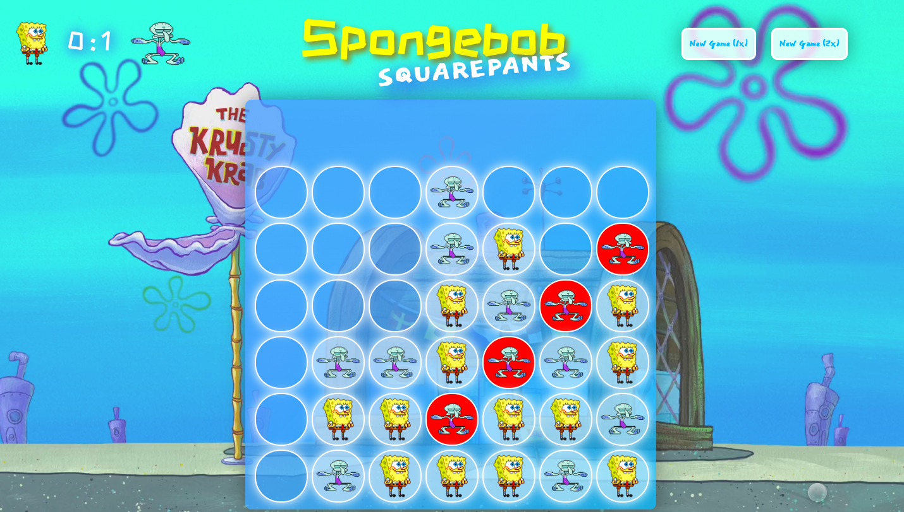

# Software Engineneering Immersive: Project 1
This was my first project during the fourth week of the General Assembly Software Engineering Immersive course.

---

# Spongebob SquarePants Connect Four

This is a browser game of Connect four built with Javascript.

## Built With

* HTML5 + HTML5 Audio
* CSS & Animation
* Javascript (ECMAScript6)
* GitHub

## Deployment

The game is deployed on GitHub Pages and it can be found here: https://mialearnstocode.github.io/sei-project-1/

## Getting Started

Use the clone button to download the game source code. Open the index.html file in your browser and the game should start, if not check console for any issues. The images used in this game are stored in the images folder and are all png file.

## Game Architecture

Connect 4 is a game where players attempt to make a line of four pieces in a 7 x 6 grid. Players can drop their pieces into columns, so that their piece rests in the lowest available space in that column.

The game has two modes which the player can choose from: one player or two players.

In the **two players mode** the players take turns to drop a Spongebob or a Squidward respectively until one of them manages to place four in a line vertically, horizontally or diagonally.

In the **one player mode** the player plays as Spongebob against the computer (Squidward). The computer reacts to Spongebob's move following these rules:

1) It checks if Spongebob has three in a row (vertical, diagonal or horizontal) and plays on the fourth circle. This for now only works if Spongebob's last move was to place the third circle. There's also an animation that shakes the three Spongebobs in a line to indicate that squidward defended.

2) If there's no '3 in a line' then it checks for 2s in a line in all directions.

3) If there's no '2 in a line' either then it generates a random number between 0 and 2 and if 0 then places the player on the first available left hand side column. If 1 then places it above and if 2 then on the right.

As the board fills up, there are also some rules that set an hierarchy to tell Squidward where to go if the column it's meant to go to is already full. It looks at the closest columns available then moves on to ones further away. If there are no more available places then **it's a draw**.

After every move of both players (or both the player and the computer), the game checks for 'winning' or 'loosing'. Winning assigns and point to Spongebob and loosing assigns one to Squidward. The functions also highlight the cells that won/lost respectively yellow or red and the top row is hidden so the player can't continue to play on.

## Challenges and future improvements

The main challenge of this project was to create a sound logic that allows squidward to stop Spongebob from winning too easily.

As every column behaves slightly different from one another I found it easier to split each defend function based on the column the last Spongebob was dropped in.

This strategy was effective as it allowed to easily debug which columns were being played on correctly or not. However, the code is quite long and it makes Squidward's move reliant on Spongebob's last one rather then looking at the whole game so far.

So in the future I hope to refactor the defend and play function so that the same function can be called on each column. I also hope to improve on the game and allow Squidward to defend even if there's two spongebob on one side and one on the other like so :

And finally I will add a function that tells squidward that if there's nothing to defend, then it should try to actively make a three / four in a row as currently it only wins by chance (usually 1 in 5 games).

## Author

Mia Meroi - First Project
Link to portfolio here:
